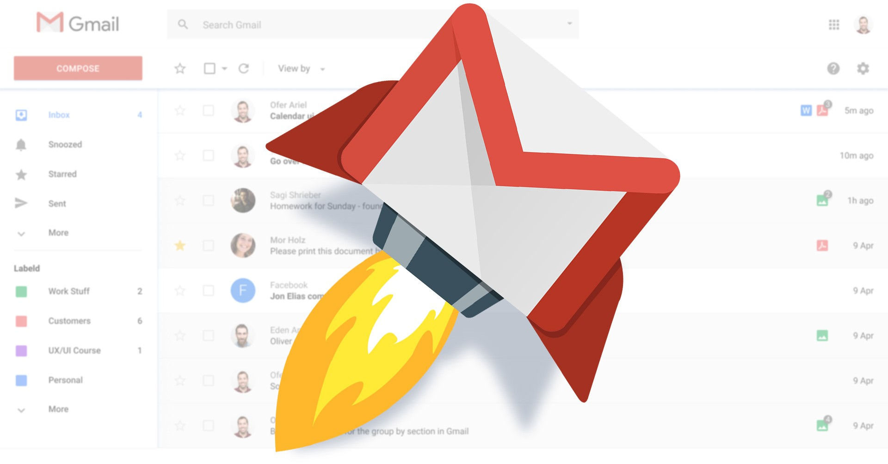
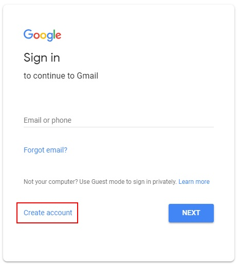
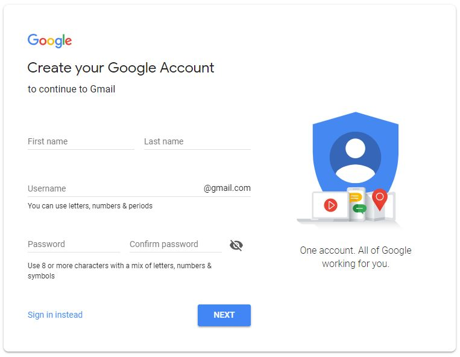
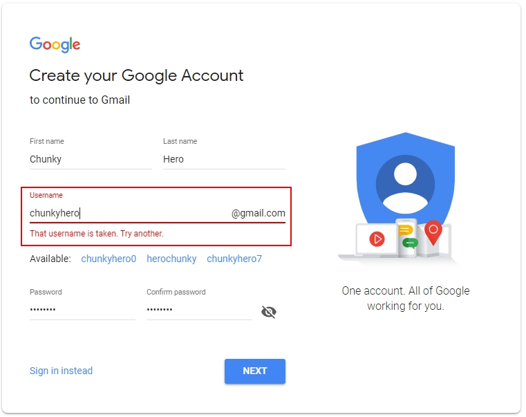
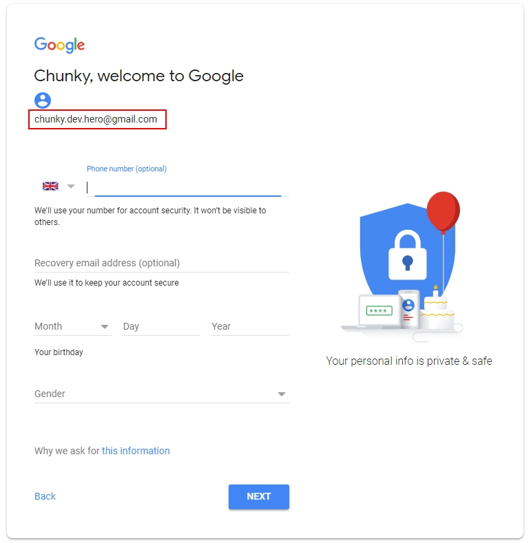
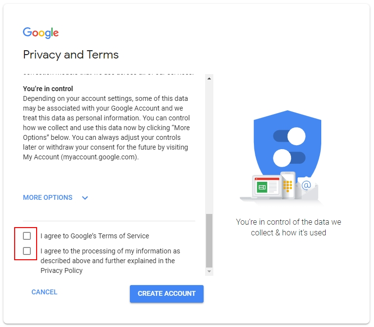
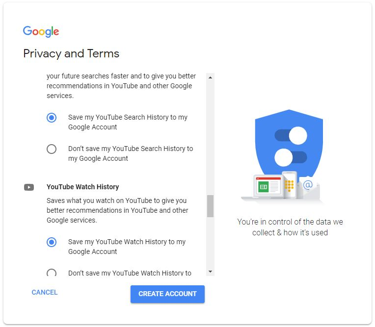

<p align="center">
  
</p>

<p align="center">
  <h2 align="center"> Challenge #1: "Create your email account" (Pre-Release)</h2>
</p>

Let's create an email account. This will be very useful for you, allowing you to get access to so many sites/services. For now you will learn how to use this account to get access to the biggest online repository, named GitLab where you can store your website.
```$xslt
define your own brand, copywriting, json manipulation, gitlab.
```


* **Author:** Cristofor
* **Level:** Beginner
* **Tags:** web, json, getting started, gitLab, Markdown

---
###

## Create your email address
We will chose Google mail as email service

## Tasks

### 1. Log in to gmail.com
Open your browser (Google Chrome, Mozilla Firefox, Opera, etc) and in the address bar type in gmail.com, then hit ENTER. You will be presented with a similar window as below. Select **Create account** button.

<p align="center">
  
</p>

### 1. Create a new account
**Create your Google account** window be presented to you.
<p align="center">

</p>

Enter your **First name** and **Last Name** and chose a **Username** and **Password**. Retype your password in the **Confirm password** field. Once done, click **NEXT** button. Make sure to carefully read the requirements for the username and password. Also, the username should be unique, otherwise you will be asked to chose a different username. For example, if I try to use chunkybuddy as username, I will get an error, asking me to chose a different username.

<p align="center">

</p>

If the username you chose is unique (not existing yet), for example, if I choose chunky.dev.hero, after clicking the **NEXT** button, you get Welcome page, showing you the new email address. Your email address will be on this format **your_username@gmail.com**

<p align="center">

</p>

You should provide **Your birthday** and **Gender**, and optionally add your phone number and your recovery email address. Once done, click **NEXT** button. Birthday should prove you are at list 14 years old, so you may have to chose it accordingly.

You will be presented the Privacy and Terms window. Check the two boxes, and click **CREATE ACCOUNT** button.
<p align="center">

</p>

You'll get a new window, where you can customize your account. By clicking the **MORE OPTION** button, you will be able you to change the account's settings and info. Explore all the options and chose the desired configuration. Once you are happy with your setup, click the **CREATE ACCOUNT** button.

<p align="center">

</p>
