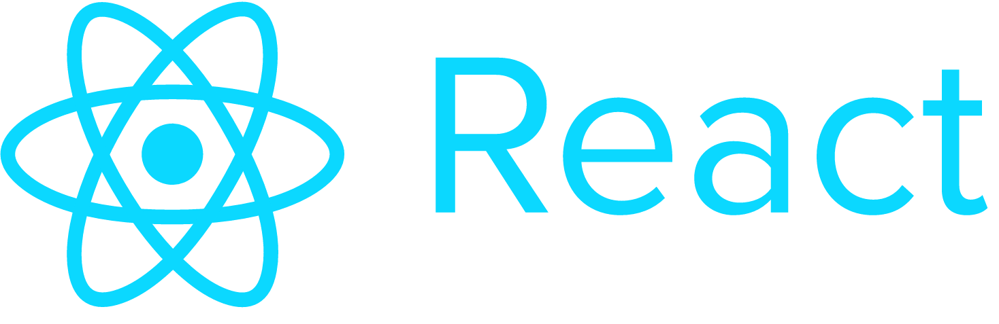

<p align="center">
  
</p>

<p align="center">
  <h2 align="center"> Challenge #1: "Getting deeper into React" (Pre-Release)</h2>
</p>

Now that you successfully created your first Component let's get deeper into it.

By doing this you will acquire the following rewards:
```$xslt
react, library, javascript
```


* **Author:** Robert P.
* **Level:** Intermediate
* **Tags:** web, getting started, react, javascript

---
###


### Let's pass some props and set some state

### Tasks