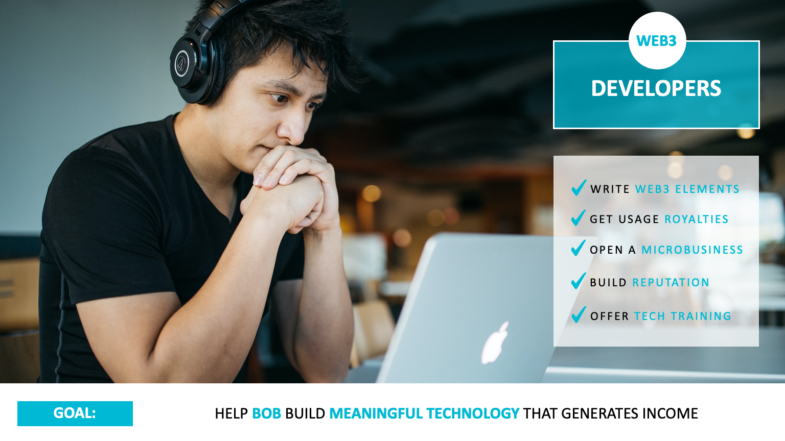

### 2. Development

* **Hero:** Bob (The Developer)
* **Goal:** Build meaningful technology that generates income.
* **Plot:** Developers open tech microbusinesses and get paid by taking on complex microjobs to build reusable web3 elements while building reputation and offering tech training.
* **Product:** Command-Line Interface (CLI)
* **Needs:**
  1. Write Web3 Elements
  2. Get Usage Royalties
  3. Open A Microbusiness
  4. Build Reputation
  5. Offer Tech Training

#### Alpha

###### [Progress Dashboard](https://github.com/fluidtrends/carmel/projects/8)

  * **Chapters:**
    1. [Tracking development progress](https://github.com/fluidtrends/carmel/issues/873)
    2. [Development documentation](https://github.com/fluidtrends/carmel/issues/874)
    3. [Code management](https://github.com/fluidtrends/carmel/issues/875)
    4. [Installation](https://github.com/fluidtrends/carmel/issues/876)
    5. [Register command](https://github.com/fluidtrends/carmel/issues/877)
    6. [Login command](https://github.com/fluidtrends/carmel/issues/878)
    7. [Recover command](https://github.com/fluidtrends/carmel/issues/879)
    8. [Config command](https://github.com/fluidtrends/carmel/issues/880)
    9. [Elements command](https://github.com/fluidtrends/carmel/issues/881)
    10. [Mesh command](https://github.com/fluidtrends/carmel/issues/882)
    11. [Vault command](https://github.com/fluidtrends/carmel/issues/883)
