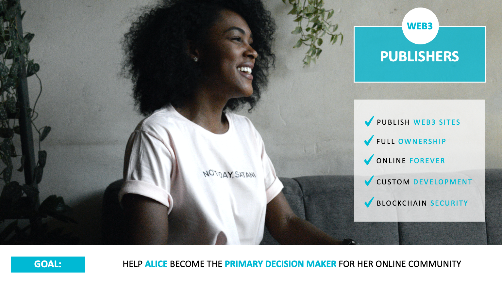

### 1. Publishing

* **Hero:** Alice (The Publisher)
* **Goal:** Become the primary decision maker for her online community.
* **Plot:** Publishers subscribe to a plan to create and fully own customizable web3 sites that remain online forever and are blockchain secured.
* **Product:** Publishing Portal (PORTAL)
* **Needs:**
  1. Publish Web3 Sites
  2. Full Ownership
  3. Online Forever
  4. Custom Development
  5. Blockchain Security

#### Alpha

###### [Progress Dashboard](https://github.com/fluidtrends/carmel/projects/7)

* **Chapters:**
    1. [Installing the Carmel Studio](https://github.com/fluidtrends/carmel/issues/850)
    2. [Setting up](https://github.com/fluidtrends/carmel/issues/851)
    3. [Authenticating](https://github.com/fluidtrends/carmel/issues/852)
    4. [Recovering an account](https://github.com/fluidtrends/carmel/issues/853)
    5. [Viewing a public profile](https://github.com/fluidtrends/carmel/issues/854)
    6. [Viewing a my dashboard](https://github.com/fluidtrends/carmel/issues/855)
    7. [Viewing a my profile](https://github.com/fluidtrends/carmel/issues/856)

#### Alpha2
* **Chapters:**
    2
    4. [Finding a domain](https://github.com/fluidtrends/carmel/issues/857)
    5. [Browsing premium domains](https://github.com/fluidtrends/carmel/issues/858)
    6. [Placing a domain order](https://github.com/fluidtrends/carmel/issues/859)
    7. [Viewing purchased domains](https://github.com/fluidtrends/carmel/issues/860)
    8. [Viewing domain details](https://github.com/fluidtrends/carmel/issues/861)
    9. [Creating a new site](https://github.com/fluidtrends/carmel/issues/862)
    10. [Viewing created sites](https://github.com/fluidtrends/carmel/issues/863)
    11. [Viewing site details](https://github.com/fluidtrends/carmel/issues/864)
    12. [Updating site details](https://github.com/fluidtrends/carmel/issues/865)
    13. [Updating site content](https://github.com/fluidtrends/carmel/issues/866)
    14. [Viewing site elements](https://github.com/fluidtrends/carmel/issues/867)
    15. [Viewing element details](https://github.com/fluidtrends/carmel/issues/868)
    16. [Updating element details](https://github.com/fluidtrends/carmel/issues/869)
    17. [Viewing elements library](https://github.com/fluidtrends/carmel/issues/870)
    18. [Adding an element](https://github.com/fluidtrends/carmel/issues/871)
    19. [Removing an element](https://github.com/fluidtrends/carmel/issues/872)
